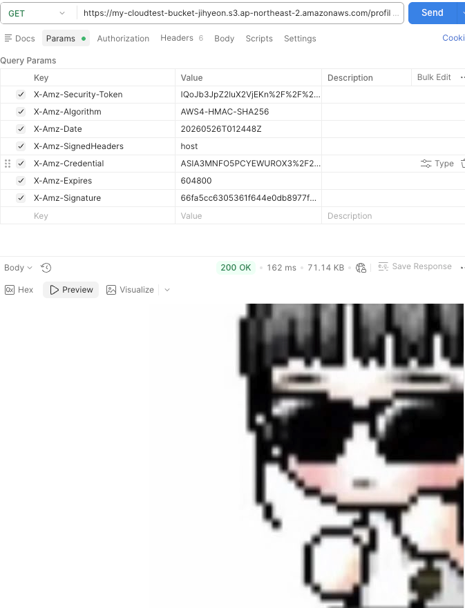

# cloudTest

### AWS Budget 설정

### EC2 퍼블릭 IP
http://13.209.12.144:8080

## Lv. 1 - 네트워크 구축 및 핵심 기능 배포

### Actuator Health 엔드포인트
http://13.209.12.144:8080/actuator/health

---

## Lv. 2 - DB 분리 및 보안 연결

### Actuator Info 엔드포인트
http://13.209.12.144.8080/actuator/info

### RDS 보안 그룹 스크린샷

---

## Lv. 3 - S3 프로필 이미지

### Presigned URL
URL: [GET /api/members/{id}/profile-image 호출해서 받은 URL]
만료 시간: [발급일로부터 7일 후 날짜]

### 접근 성공 스크린샷

